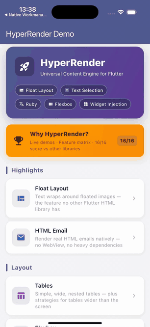
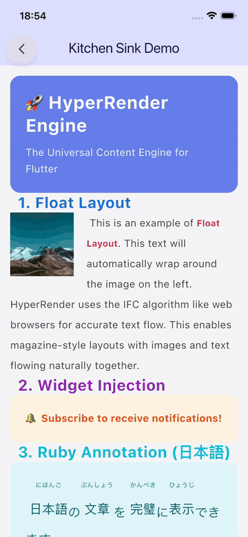
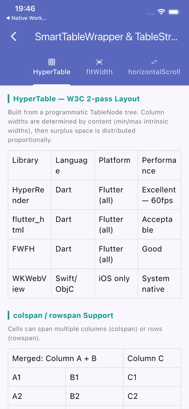

<div align="center">

# HyperRender

**A custom layout engine for Flutter that renders HTML, Markdown, and Quill Delta.**

[](https://pub.dev/packages/hyper_render)
[](https://opensource.org/licenses/MIT)
[](https://flutter.dev)

[Quick Start](#quick-start) · [Features](#features) · [Benchmarks](#benchmarks) · [API Reference](#api-reference) · [When not to use](#when-not-to-use)

</div>

---

## Visual Showcase

| **CSS Float — Magazine Layout** | **60 FPS Performance** | **Flexbox & Smart Tables** |
|:---:|:---:|:---:|
|  |  |  |
| *Text wrapping around images — impossible in widget-tree renderers.* | *Smooth scrolling on 25k+ character documents.* | *Flexbox gap/wrap and auto-scaling tables.* |

---

## The architectural problem with widget-based HTML renderers

Most Flutter HTML libraries (`flutter_widget_from_html`, `flutter_html`) work by mapping each HTML tag to a Flutter widget — `Column`, `Row`, `Padding`, `Wrap`, `RichText`. A typical 3,000-word news article produces 400–600 widgets deep in a tree.

This creates fundamental limitations that cannot be fixed without replacing the rendering model:

| Problem | Root cause |
|---------|-----------|
| `float: left/right` not possible | The `Column` wrapping text has no access to the `Image` widget's coordinates. There is no shared coordinate system across widget boundaries. |
| Text selection crashes on large documents | Selection spans multiple independent `RichText` nodes. When crossing widget boundaries, Flutter's selection machinery breaks. |
| Broken CJK line-breaking | Kinsoku rules require knowing the next character before deciding where to break. Widget boundaries prevent this look-ahead. |
| `<ruby>/<rt>` shows as raw text | Ruby annotation requires the base text and furigana to share the same layout context. Two widgets cannot achieve this. |

HyperRender replaces the widget tree with a single custom `RenderObject`. The entire document — text, images, tables, floats — is laid out and painted in one pass, in one coordinate system.

```
HTML input  →  Adapter  →  Unified Document Tree  →  CSS Resolver  →  Single RenderObject  →  Canvas
```

---

## Quick Start

```yaml
# pubspec.yaml
dependencies:
  hyper_render: ^1.0.0
```

```dart
import 'package:hyper_render/hyper_render.dart';

// Sanitization is enabled by default.
HyperViewer(
  html: articleHtml,
  onLinkTap: (url) => launchUrl(Uri.parse(url)),
)
```

---

## Features

### CSS Float layout

Wrapping text around floated images requires a unified coordinate system — something that is architecturally impossible in a widget tree. HyperRender is currently the only Flutter HTML library that supports this.

```dart
HyperViewer(
  html: '''
    <article>
      
      <p>Text flows naturally around the floated image, just like a browser.</p>
    </article>
  ''',
)
```

---

### Text selection across large documents

The entire document is one continuous span tree, so selection works across paragraphs, headings, and table cells without widget-boundary issues.

```dart
HyperViewer(
  html: longArticleHtml,
  selectable: true,                    // default: true
  selectionHandleColor: Colors.blue,
  selectionMenuActionsBuilder: (ctrl) => [
    SelectionMenuAction(label: 'Copy', onTap: ctrl.copySelection),
  ],
)
```

---

### CJK typography: Kinsoku and Ruby/Furigana

```dart
HyperViewer(
  html: '''
    <p style="font-size: 20px; line-height: 2;">
      <ruby>東京<rt>とうきょう</rt></ruby>で
      <ruby>日本語<rt>にほんご</rt></ruby>を勉強しています。
    </p>
  ''',
)
```

Furigana renders above the base characters with proper horizontal centering. Kinsoku line-breaking rules (no dangling `」`, no leading `、`) are applied across the entire line, not per-widget.

---

### CSS Variables and `calc()`

```dart
HyperViewer(
  html: '''
    <style>
      :root { --brand: #6750A4; --gap: 16px; }
      .card {
        background: var(--brand);
        padding: calc(var(--gap) * 1.5);
        border-radius: 12px;
        color: white;
      }
    </style>
    <div class="card">Themed with CSS custom properties</div>
  ''',
)
```

---

### Flexbox

```dart
HyperViewer(
  html: '''
    <div style="display: flex; justify-content: space-between;
                align-items: center; gap: 16px;">
      <strong>Logo</strong>
      <nav style="display: flex; gap: 20px;">
        <a href="/home">Home</a>
        <a href="/blog">Blog</a>
      </nav>
    </div>
  ''',
)
```

Supported properties: `flex-direction`, `justify-content`, `align-items`, `align-self`, `align-content`, `flex-wrap`, `flex-grow`, `flex-shrink`, `flex-basis`, `gap`.

---

### CSS Grid

```dart
HyperViewer(
  html: '''
    <div style="display: grid; grid-template-columns: 1fr 2fr 1fr; gap: 12px;">
      <div style="background: #E3F2FD; padding: 16px;">Sidebar</div>
      <div style="background: #F3E5F5; padding: 16px;">Main</div>
      <div style="background: #E8F5E9; padding: 16px;">Aside</div>
    </div>
  ''',
)
```

---

### Tables with smart layout

Tables use a two-pass W3C column-width algorithm (min-content → distribute surplus). Three overflow strategies are available:

```dart
// Auto-selected based on table width attribute, or set manually:
SmartTableWrapper(
  tableNode: myTableNode,
  strategy: TableStrategy.horizontalScroll, // fitWidth | autoScale | horizontalScroll
)
```

Full `colspan` and `rowspan` support, including nested tables.

---

### `<details>` / `<summary>` — collapsible sections

```html
<details>
  <summary>Click to expand</summary>
  <p>Content revealed on tap.</p>
</details>
```

---

### Multi-format input

```dart
// HTML
HyperViewer(html: '<h1>Hello</h1><p>World</p>')

// Quill Delta JSON
HyperViewer.delta(delta: '{"ops":[{"insert":"Hello\\n"}]}')

// Markdown
HyperViewer.markdown(markdown: '# Hello\n\n**Bold** and _italic_.')

// Custom CSS injected after document styles
HyperViewer(
  html: articleHtml,
  customCss: 'body { font-size: 18px; line-height: 1.8; }',
)
```

---

### Hybrid WebView fallback via `HtmlHeuristics`

For HTML that requires JavaScript or unsupported CSS features (`position: fixed`, `<canvas>`, `<form>`), HyperRender can detect complexity automatically and hand off to a WebView:

```dart
// Automatic — HtmlHeuristics.isComplex() is checked in build()
HyperViewer(
  html: maybeComplexHtml,
  fallbackBuilder: (context) => WebViewWidget(controller: _controller),
)

// Manual detection
if (HtmlHeuristics.isComplex(html)) {
  // Use WebView
}

// Fine-grained checks
HtmlHeuristics.hasUnsupportedCss(html)      // position:fixed, clip-path, columns
HtmlHeuristics.hasUnsupportedElements(html)  // canvas, form, input, select
HtmlHeuristics.hasComplexTables(html)        // deeply nested or wide tables
```

---

### Screenshot export

```dart
final captureKey = GlobalKey();

HyperViewer(html: articleHtml, captureKey: captureKey)

// Capture to PNG
final bytes = await captureKey.toPngBytes();  // Uint8List
final image = await captureKey.toImage();      // ui.Image
```

---

### RTL / BiDi

```html
<p dir="rtl">هذا نص عربي من اليمين إلى اليسار</p>
<p dir="ltr">Back to left-to-right.</p>
```

---

## Security

Sanitization is on by default. `HyperViewer` strips `<script>`, event handlers, `javascript:` and `vbscript:` URLs, SVG data URIs, and CSS `expression()` before rendering.

```dart
// Safe by default
HyperViewer(html: userGeneratedContent)

// Custom tag allowlist
HyperViewer(
  html: userContent,
  allowedTags: ['p', 'a', 'img', 'strong', 'em', 'ul', 'ol', 'li'],
)

// Disable only for fully trusted, backend-controlled HTML
HyperViewer(html: trustedCmsHtml, sanitize: false)
```

What gets removed:
- Tags: `<script>`, `<iframe>`, `<object>`, `<embed>`, `<form>`, `<input>`
- Attributes: all `on*` event handlers (`onclick`, `onerror`, `onload`, etc.)
- URLs: `javascript:`, `vbscript:`, `data:text/...`, `data:application/...`
- CSS: `expression(...)` (IE-era injection vector)

---

## Benchmarks

> **Self-measured on macOS (Apple Silicon, Flutter Desktop release mode).** Run the benchmark suite locally to reproduce on your target hardware.
> Numbers for FWFH and WebView are estimates based on architecture and publicly available profiler traces — they have not been independently verified.

| Metric | flutter_widget_from_html | HyperRender |
|--------|:---:|:---:|
| Parse time — 1 KB HTML | ~50 ms | **27 ms** |
| Parse time — 10 KB HTML | ~250 ms (est.) | **69 ms** |
| Parse time — 50 KB HTML | ~600 ms (est.) | **276 ms** |
| CSS rule lookup (5,000 rules) | O(n) scan | **3 µs median (O(1) index)** |
| Float layout | ❌ | ✅ |
| Text selection on 100 K chars | ❌ Crashes | ✅ |
| Ruby / Furigana | ❌ | ✅ |
| `<details>/<summary>` | ❌ | ✅ |

**How to reproduce:**

```bash
cd benchmark/
flutter run --release benchmark/performance_test.dart
```

HyperRender parse times are from `benchmark/RESULTS.md`, measured with `flutter test` on macOS Desktop. HyperRender benchmarks scale approximately linearly with document size.

---

## Architecture

HyperRender uses a four-layer pipeline:

```
┌──────────────────────────────────────────────────────┐
│    Input: HTML / Quill Delta / Markdown              │
└──────────────────────────┬───────────────────────────┘
                           ▼
┌──────────────────────────────────────────────────────┐
│    Adapter layer                                     │
│    HtmlAdapter · DeltaAdapter · MarkdownAdapter      │
└──────────────────────────┬───────────────────────────┘
                           ▼
┌──────────────────────────────────────────────────────┐
│    Unified Document Tree (UDT)                       │
│    BlockNode · InlineNode · AtomicNode · RubyNode    │
│    TableNode · DetailsNode                           │
└──────────────────────────┬───────────────────────────┘
                           ▼
┌──────────────────────────────────────────────────────┐
│    CSS Style Resolver                                │
│    UA defaults → <style> rules → inline → inherit   │
│    Specificity cascade · CSS Variables · calc()      │
│    O(1) tag/class/ID index via CssRuleIndex          │
└──────────────────────────┬───────────────────────────┘
                           ▼
┌──────────────────────────────────────────────────────┐
│    Single RenderHyperBox                             │
│    BFC · IFC · Flexbox · Grid · Table · Float        │
│    Kinsoku line-breaking · Continuous span tree      │
│    Direct Canvas painting · LRU image cache (50 MB) │
└──────────────────────────────────────────────────────┘
```

A few implementation details worth noting:

- **Single RenderObject** — the entire document is painted by one `RenderBox`. This is what makes float layout and cross-document selection possible.
- **O(1) CSS lookup** — rules are indexed by tag name, class, and ID. Lookup time stays constant regardless of stylesheet size (verified: 3 µs median with 5,000 rules).
- **Image LRU cache** — bounded at 50 MB. The oldest loaded images are evicted when the limit is reached; `ui.Image` GPU objects are properly disposed.
- **Viewport culling** — paint methods skip fragments that fall outside the current clip bounds, reducing work for off-screen content.
- **One-shot `ImageStreamListener`** — removes itself on both success and error to prevent listener accumulation.

---

## API Reference

### `HyperViewer`

```dart
// HTML rendering
HyperViewer({
  required String html,
  String? baseUrl,                    // Resolve relative src/href URLs
  String? customCss,                  // Extra CSS (applied after document styles)
  bool selectable = true,
  bool sanitize = true,               // Strip unsafe tags/attributes; default ON
  List<String>? allowedTags,          // Extend the default safe allowlist
  HyperRenderMode mode = HyperRenderMode.auto,
  Function(String)? onLinkTap,
  HyperWidgetBuilder? widgetBuilder,  // Widget? Function(UDTNode node)
  WidgetBuilder? fallbackBuilder,     // Called when HtmlHeuristics.isComplex()
  GlobalKey? captureKey,              // Screenshot export
  bool enableZoom = false,
  WidgetBuilder? placeholderBuilder,  // Shown while parsing
  String? semanticLabel,
  bool excludeSemantics = false,
  bool debugShowHyperRenderBounds = false,
  List<SelectionMenuAction> Function(SelectionOverlayController)?
      selectionMenuActionsBuilder,
  Color? selectionHandleColor,
  Color? selectionColor,
})

HyperViewer.markdown(markdown: '# Hello', ...)
HyperViewer.delta(delta: jsonString, ...)
```

### `HyperWidgetBuilder` — custom widget injection

The callback receives the `UDTNode` for any atomic element. Return `null` to fall back to default rendering.

```dart
HyperViewer(
  html: htmlContent,
  widgetBuilder: (node) {
    if (node is AtomicNode && node.tagName == 'iframe') {
      final src = node.attributes['src'] ?? '';
      if (src.contains('youtube.com')) {
        return YoutubePlayerWidget(url: src);
      }
    }
    return null;
  },
)
```

### `HtmlHeuristics`

```dart
HtmlHeuristics.isComplex(html)              // true if any check below returns true
HtmlHeuristics.hasComplexTables(html)       // deeply nested or wide colspan tables
HtmlHeuristics.hasUnsupportedCss(html)      // position:fixed, clip-path, columns
HtmlHeuristics.hasUnsupportedElements(html) // canvas, form, select, input
```

### `SmartTableWrapper`

```dart
SmartTableWrapper(
  tableNode: myTableNode,
  strategy: TableStrategy.fitWidth,        // shrink columns proportionally
  // strategy: TableStrategy.horizontalScroll,
  // strategy: TableStrategy.autoScale,
  minScaleFactor: 0.6,
)
```

### `HyperCaptureExtension` (on `GlobalKey`)

```dart
final bytes = await key.toPngBytes();   // Uint8List PNG
final image = await key.toImage();      // ui.Image
```

---

## When not to use HyperRender

HyperRender is a document rendering engine, not a browser. For these needs, use a different tool:

| Need | Recommended |
|------|------------|
| Run JavaScript | `webview_flutter` |
| Interactive web forms | `webview_flutter` |
| Rich text editor | `super_editor`, `fleather` |
| `position: fixed`, `canvas`, `<form>` | `webview_flutter` (or use `fallbackBuilder`) |
| Maximum CSS property coverage | `flutter_widget_from_html` |

HyperRender is well-suited for: news apps, blog readers, email clients, documentation viewers, RSS feeds, e-book readers, and any app where large amounts of formatted text must render smoothly on a native canvas.

---

## Packages

| Package | Purpose | Status |
|---------|---------|:------:|
| `hyper_render` | Convenience wrapper — includes all packages below | ✅ Stable |
| `hyper_render_core` | Core UDT model, CSS resolver, RenderObject | ✅ Stable |
| `hyper_render_html` | HTML parser and adapter | ✅ Stable |
| `hyper_render_markdown` | Markdown adapter | ⚠️ Alpha |
| `hyper_render_highlight` | Syntax highlighting for `<code>` blocks | ✅ Stable |
| `hyper_render_devtools` | Flutter DevTools extension (UDT inspector) | 🧪 Beta |

---

## Contributing

```bash
git clone https://github.com/brewkits/hyper_render.git
cd hyper_render
flutter pub get
flutter test          # all tests must pass before submitting a PR
cd example && flutter run
```

See [doc/CONTRIBUTING.md](doc/CONTRIBUTING.md) and the Architecture Decision Records in [doc/adr/](doc/adr/) for context on design decisions.

---

## Further reading

- [Comparison Matrix](doc/COMPARISON_MATRIX.md) — feature comparison with FWFH and WebView
- [CSS Properties Matrix](doc/CSS_PROPERTIES_MATRIX.md) — full CSS support status
- [Supported HTML Elements](doc/SUPPORTED_HTML.md) — tags and attributes
- [Known Limitations](doc/LIMITATIONS.md) — honest list of unsupported features
- [Migration Guide](MIGRATION.md) — coming from `flutter_html` or `flutter_widget_from_html`
- [Architecture Decision Records](doc/adr/) — background on key design choices

---

## See also

Other open-source Flutter packages by the same team:

| Package | Description |
|---------|-------------|
| [`native_workmanager`](https://github.com/brewkits/native_workmanager) | High-performance background task manager using native Kotlin/Swift workers — executes tasks without spawning the Flutter Engine, saving up to 90% RAM and extending battery life. |

---

## License

MIT — see [LICENSE](LICENSE).

---

<div align="center">

[Get Started](#quick-start) · [Examples](example/) · [Report a Bug](https://github.com/brewkits/hyper_render/issues)

</div>
